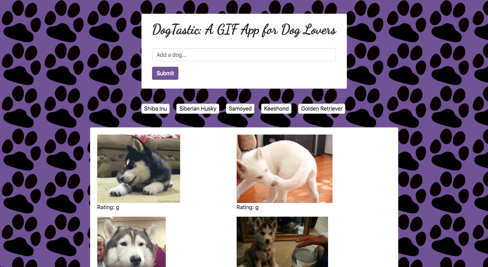

This is a HTML/CSS/JavaScript GIF app for dog lovers. It uses the GIPHY API to facilitate the process of searching for GIFs of favorite dog breeds - users can conduct a focused, topic-specific search instead of relying on general search engines like GIPHY or Google. It populates the page with ten gifs, which the user can pause and start. To use the app, please visit this URL: https://tomstone76.github.io/GifTastic/

Technologies used:
-JavaScript
-JQuery
-HTML
-CSS
-Bootstrap
-GIPHY API

